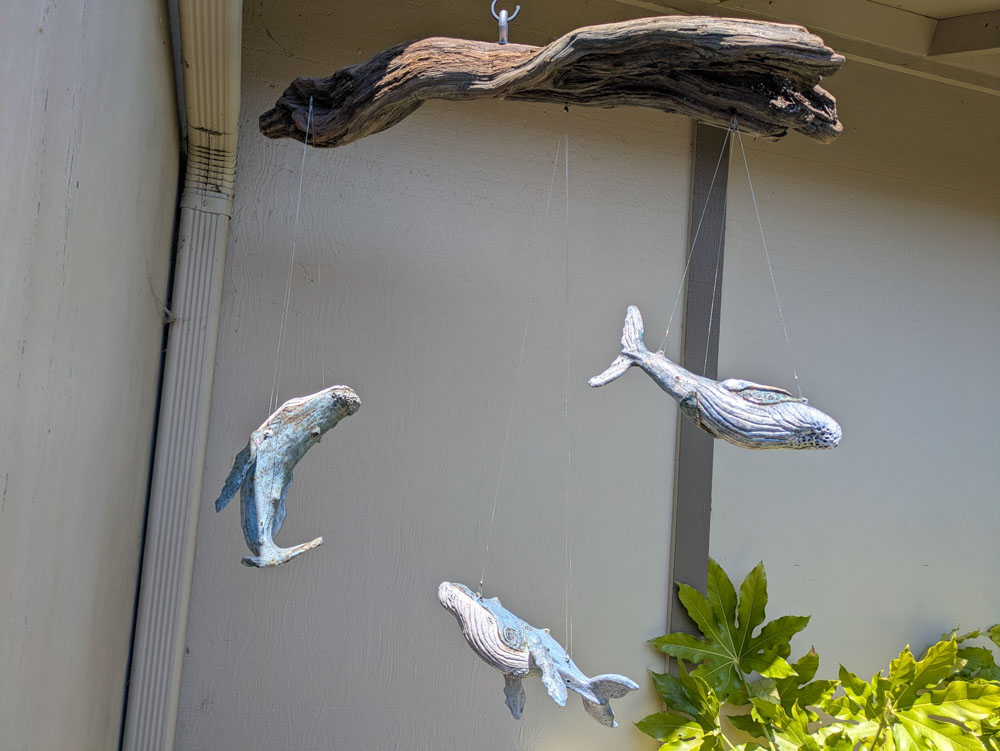
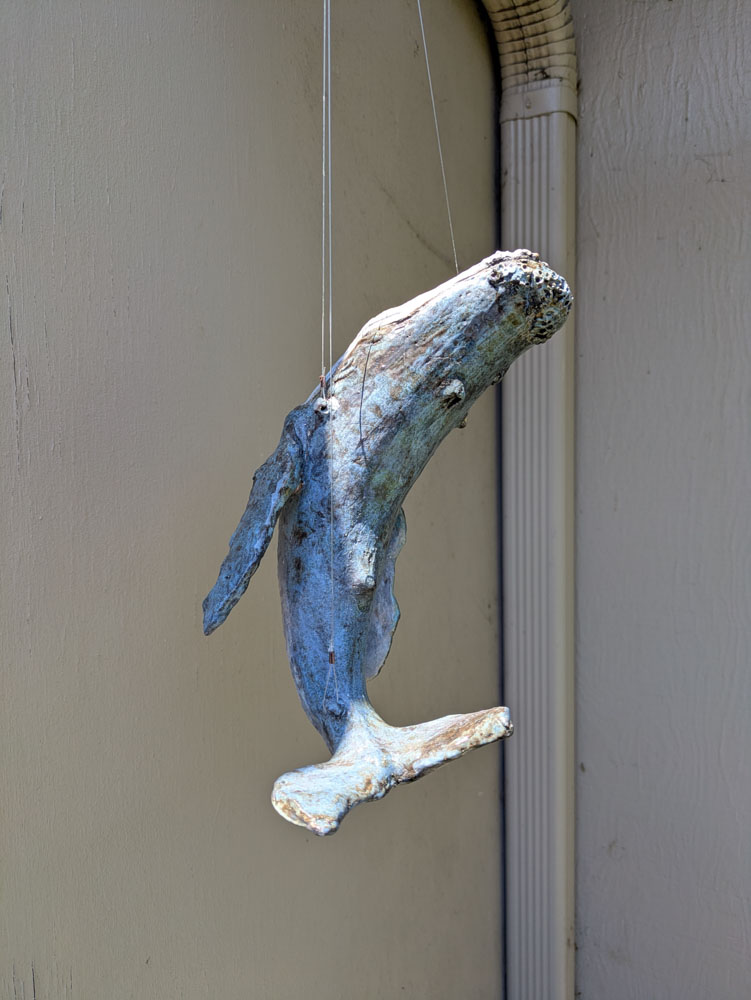
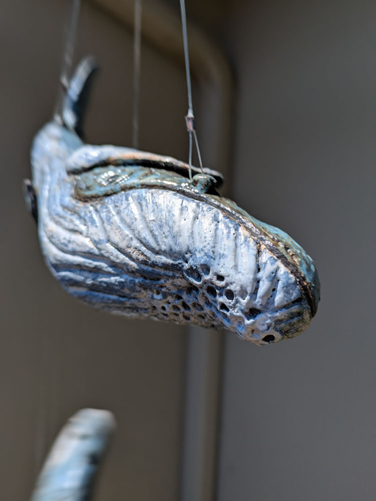
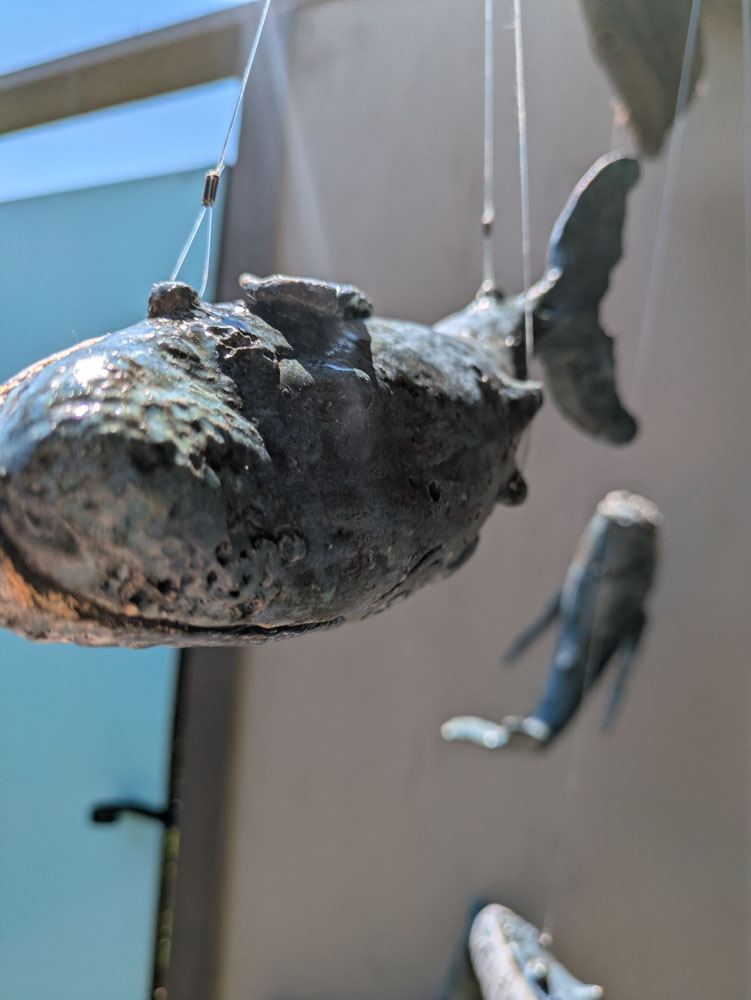
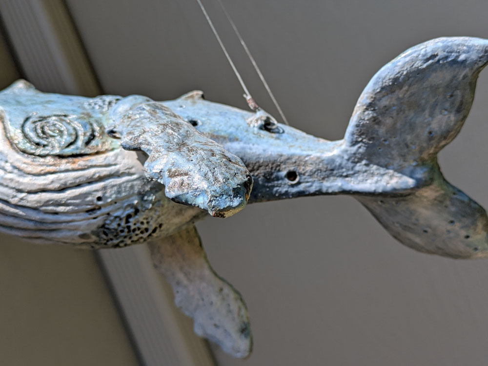
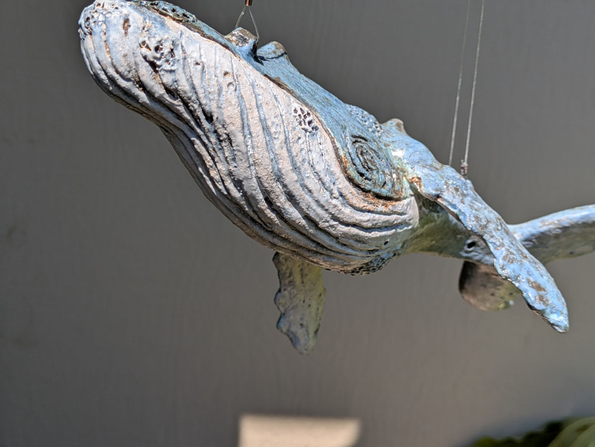
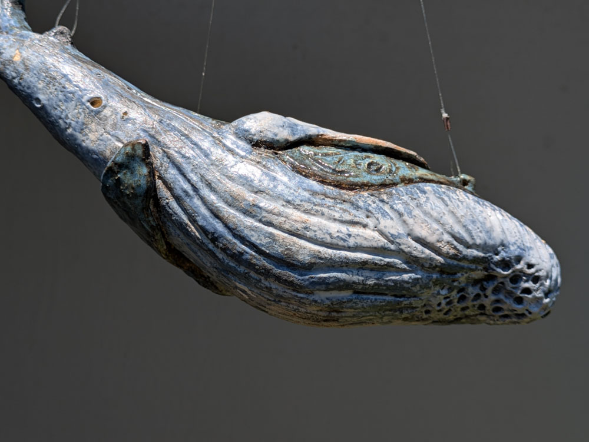
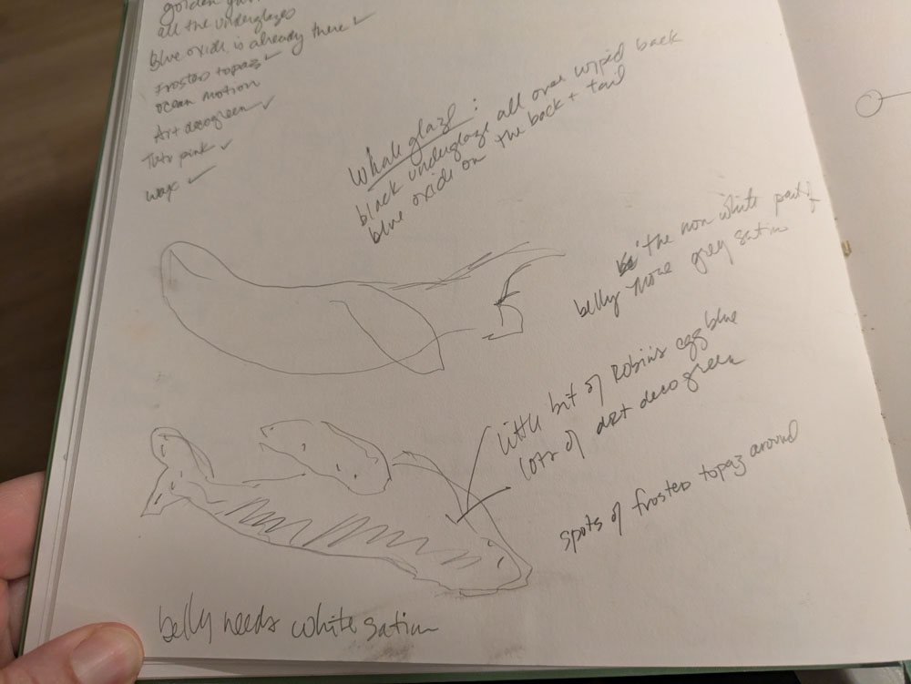

Hung from a 37" piece of driftwood from [Hobbit Beach](https://stateparks.oregon.gov/index.cfm?do=park.profile&parkId=86)

::: {layout-ncol=3}
{group="final"}

:::

<!--
Process notes:

Laguna sculpture clay
Glaze notes:

-->
 