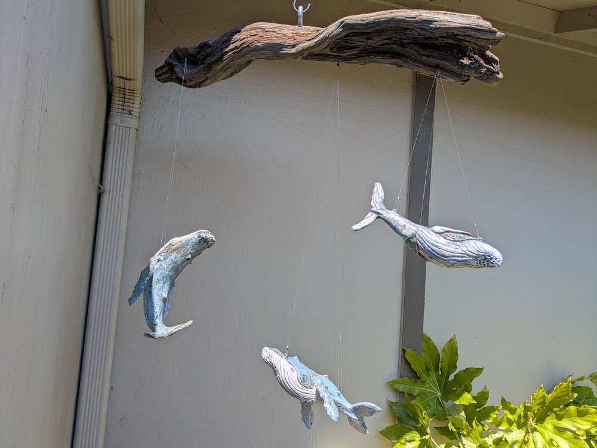
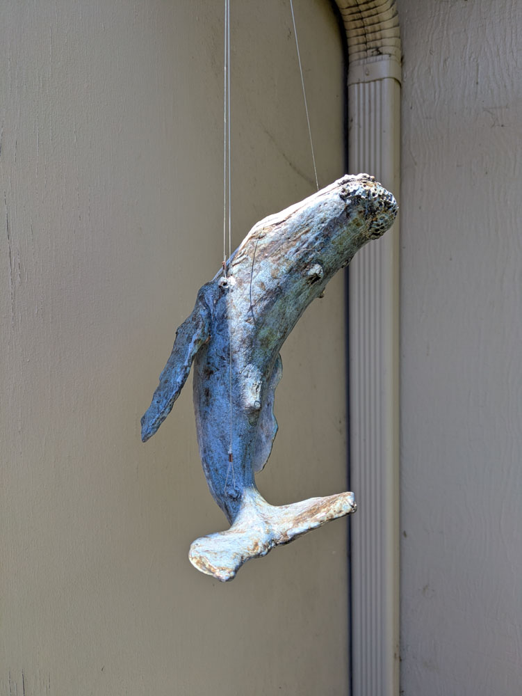
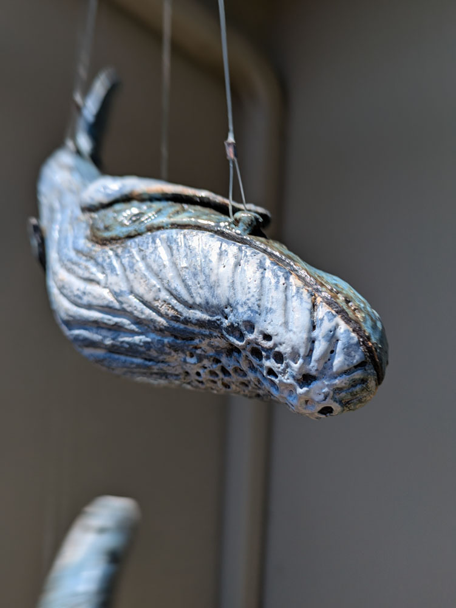
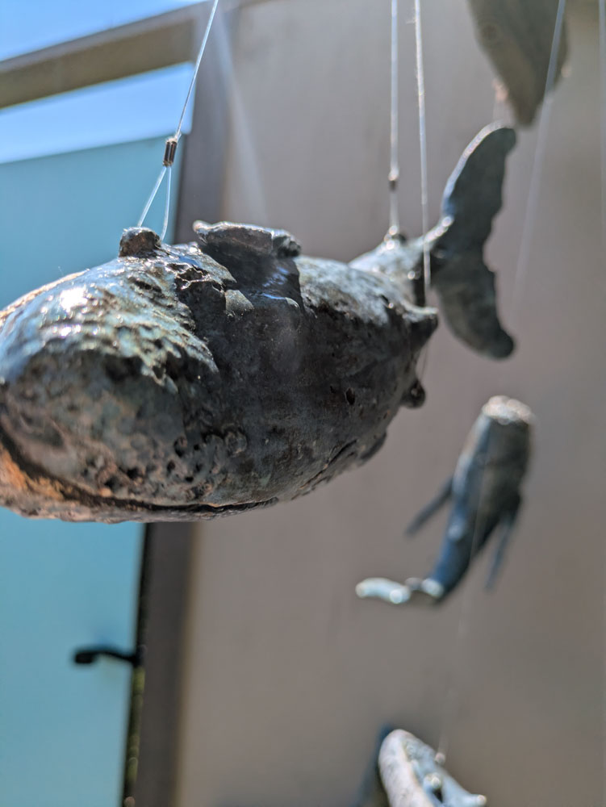
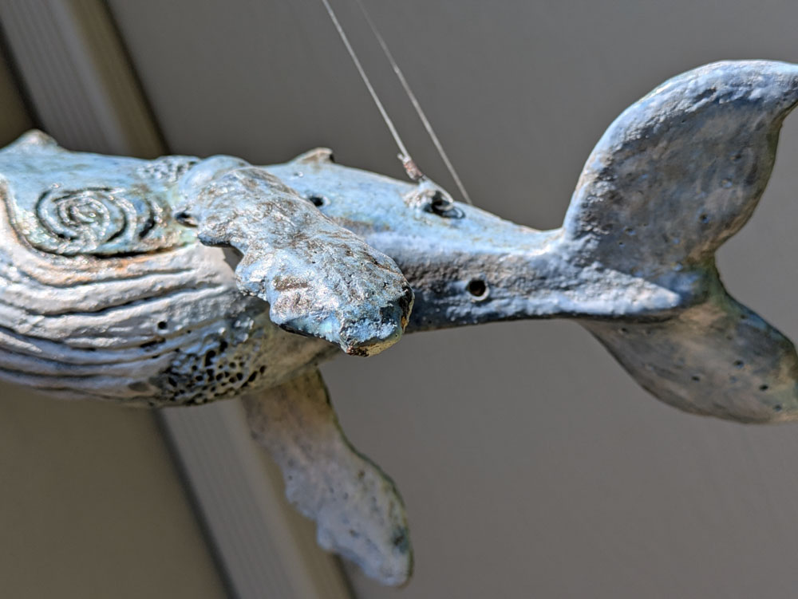
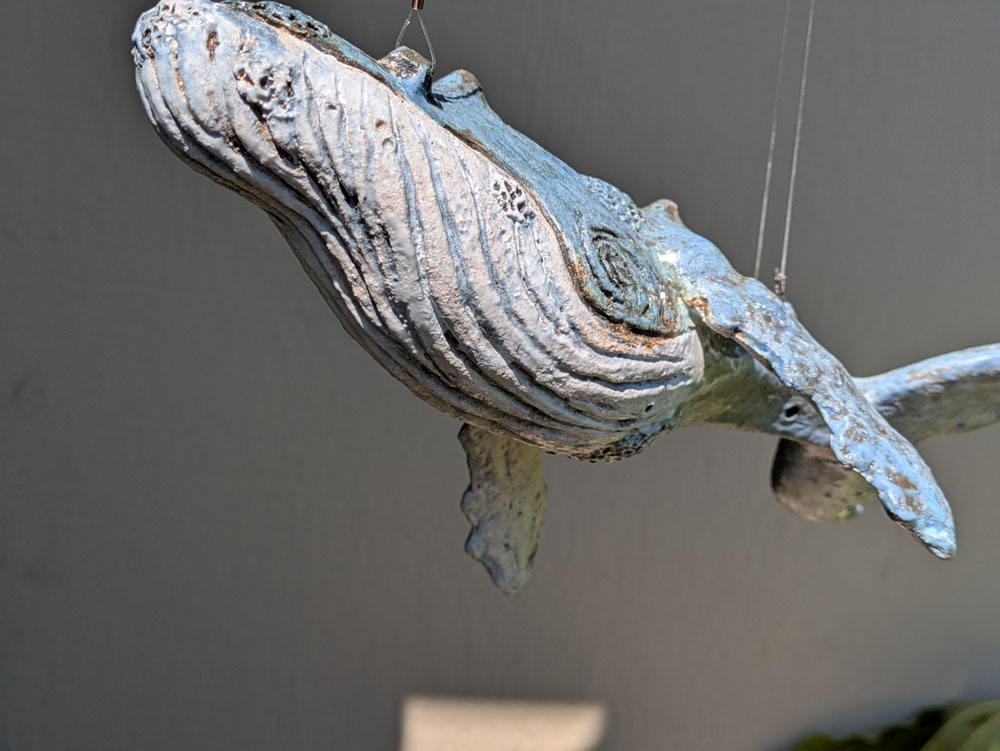
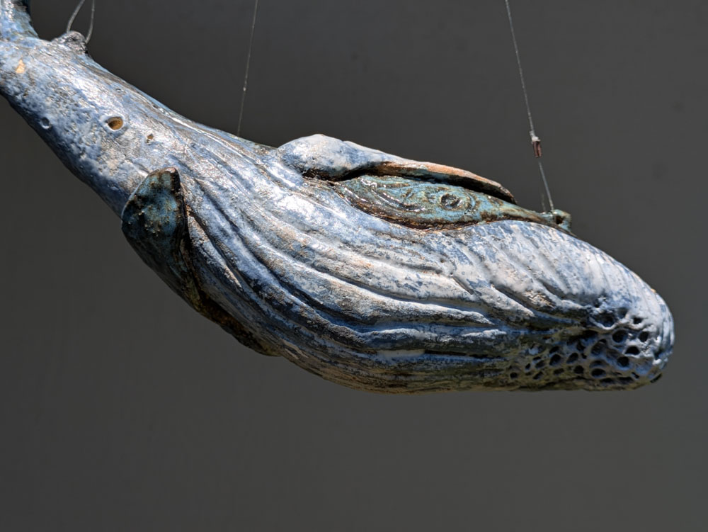
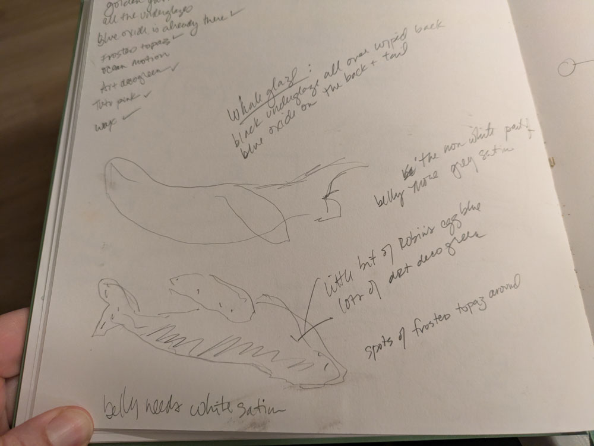

{group="amandas_whales" fig-alt="Amanda's Whales sculpture"}

Hung from a 37" piece of driftwood from [Hobbit Beach](https://stateparks.oregon.gov/index.cfm?do=park.profile&parkId=86)

::: {layout-ncol=3}
{group="amandas_whales" fig-alt="Amanda's Whales, alternate view"}

{group="amandas_whales" fig-alt="Amanda's Whales, alternate view"}

{group="amandas_whales" fig-alt="Amanda's Whales, alternate view"}

{group="amandas_whales" fig-alt="Amanda's Whales, alternate view"}

{group="amandas_whales" fig-alt="Amanda's Whales, alternate view"}

{group="amandas_whales" fig-alt="Amanda's Whales, alternate view"}

:::

<!--
Process notes:

Laguna sculpture clay
Glaze notes:
{fig-alt="Glaze notes for the whale sculptures"}
-->
 