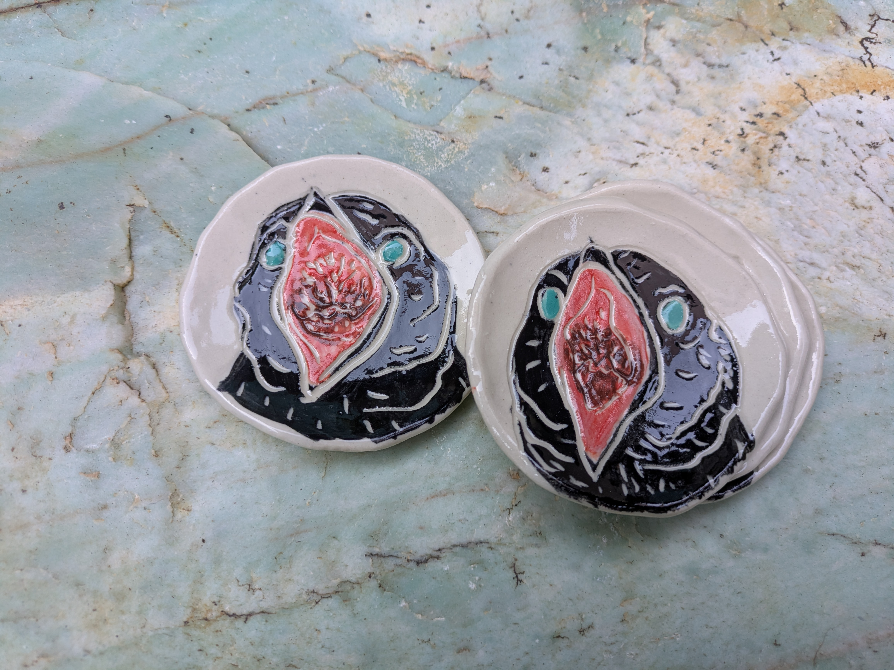

{group="crow_babies" fig-alt="Crow Babies"}

This summer I watched a juvenile crow beg for food _while she was standing on food_. The begging went on for days. Man, oh man, it really made me empathize with the parents. And crows do it every year! 
This a set of four small plates is an ode to parental patience and how hard it is to raise kids. :)
They're little plates - perfect for dunking chicken nuggets in ketchup or holding your rings. 