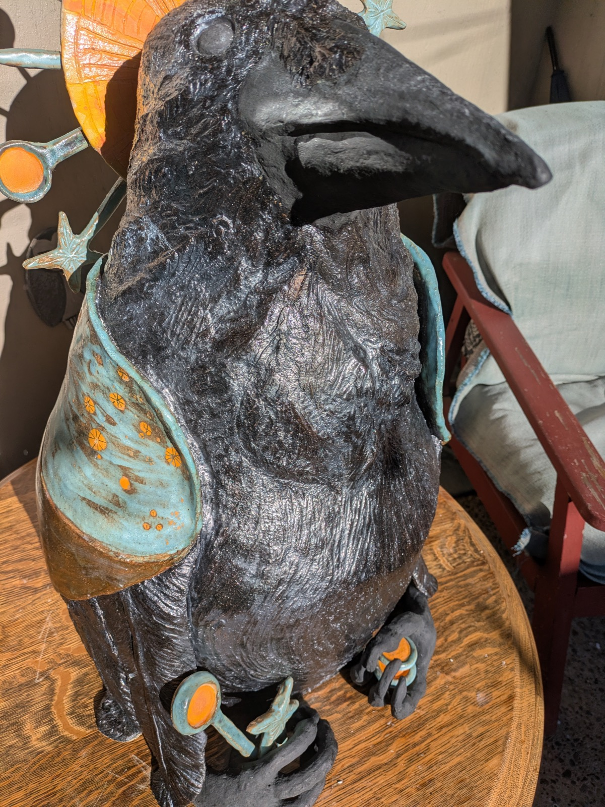
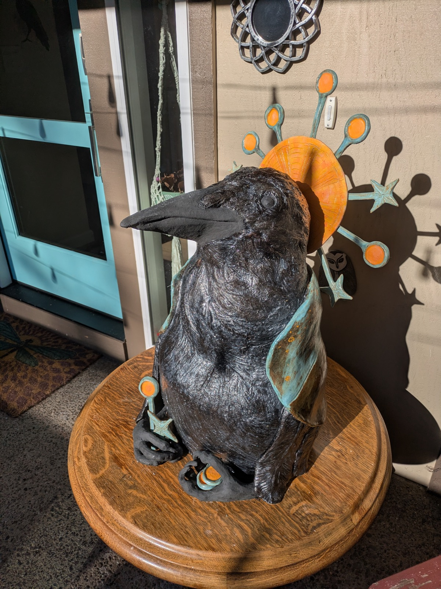
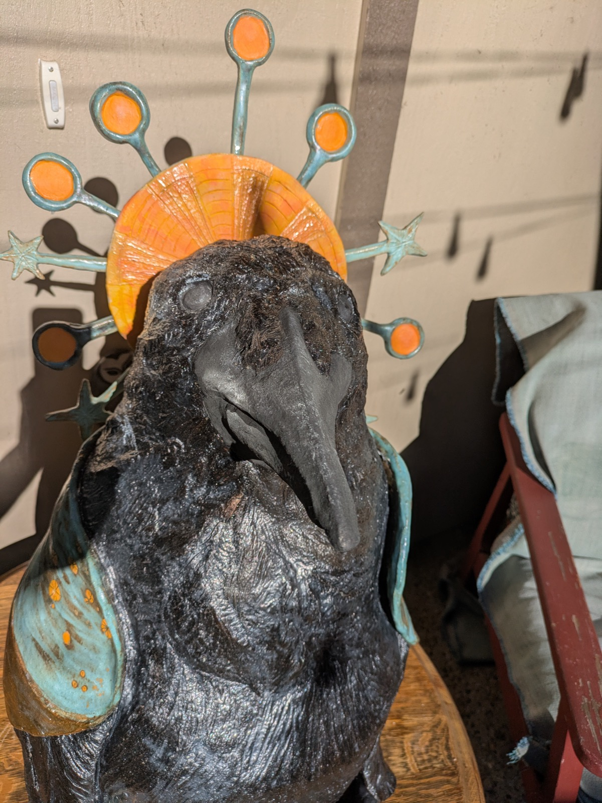
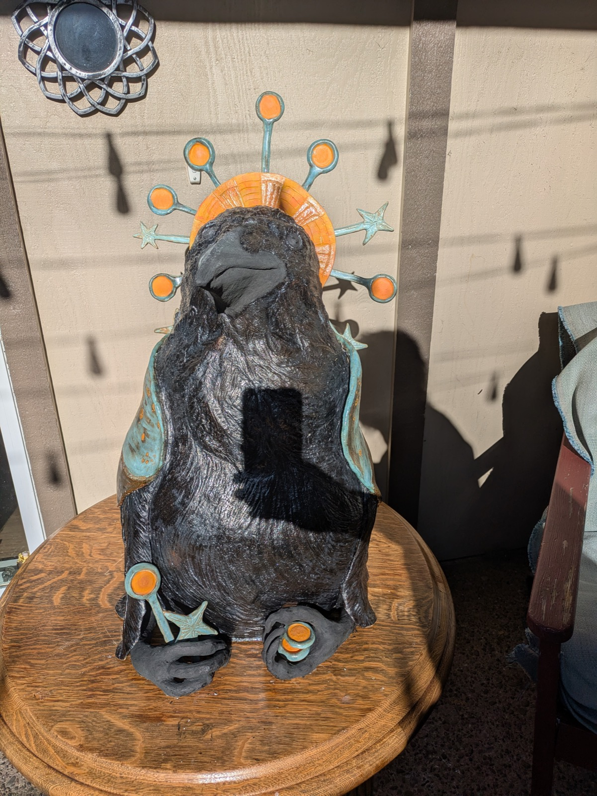
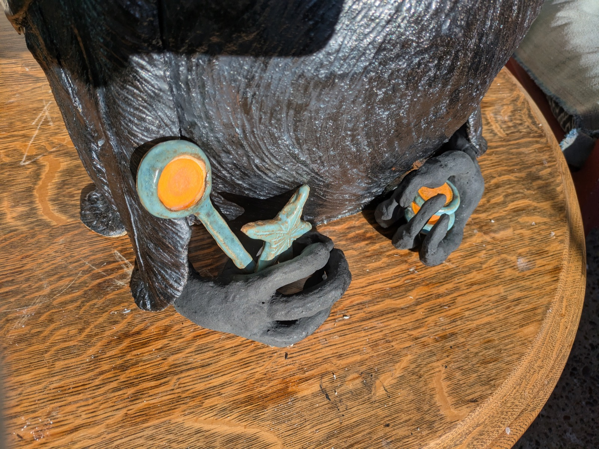
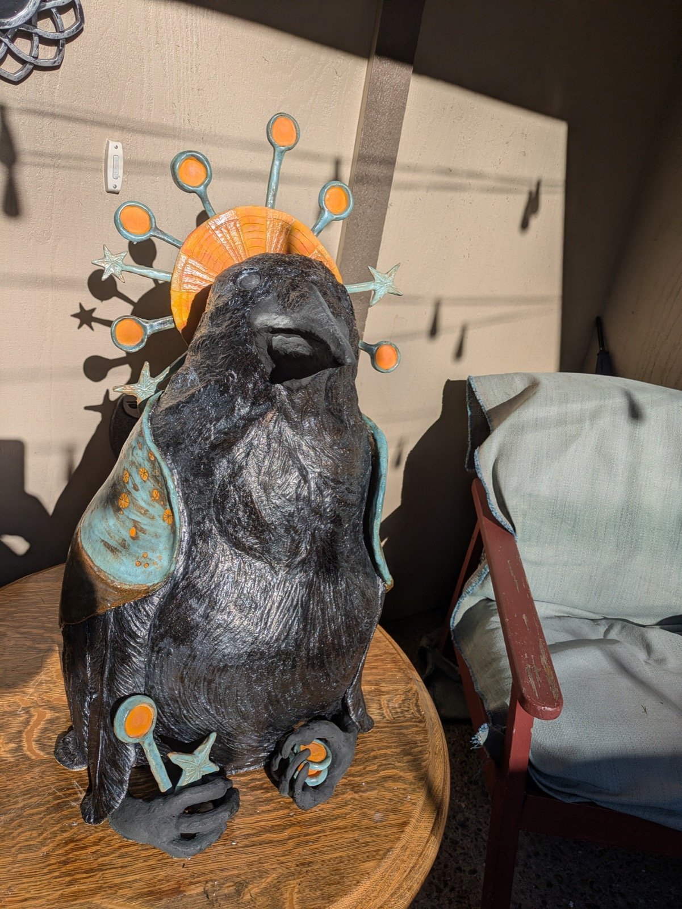
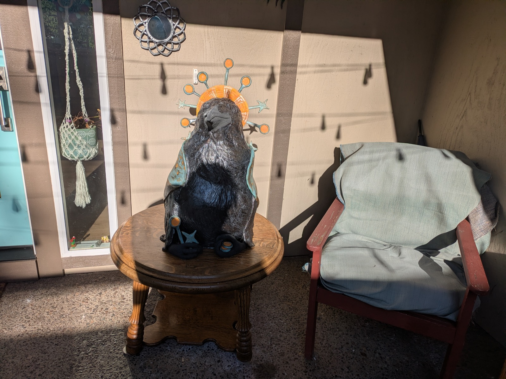

*(that sometimes get better)*

{group="goddess" fig-alt="Crow goddess sculpture, 3/4 view showing turquoise wing and orange accents"}

::: {layout-ncol=3}
{group="goddess" fig-alt="Crow goddess sculpture profile view with dramatic shadow"}

{group="goddess" fig-alt="Close-up of crow goddess head showing orange sunburst halo with turquoise orbs"}

{group="goddess" fig-alt="Front view of crow goddess holding a phone, showing turquoise wings"}

{group="goddess" fig-alt="Close-up of crow feet with orange and turquoise details, holding small treasures"}

{group="goddess" fig-alt="Crow goddess sculpture from below, looking up at the halo"}

{group="goddess" fig-alt="Full view of crow goddess sculpture on table, showing scale and setting"}
:::

## Process

