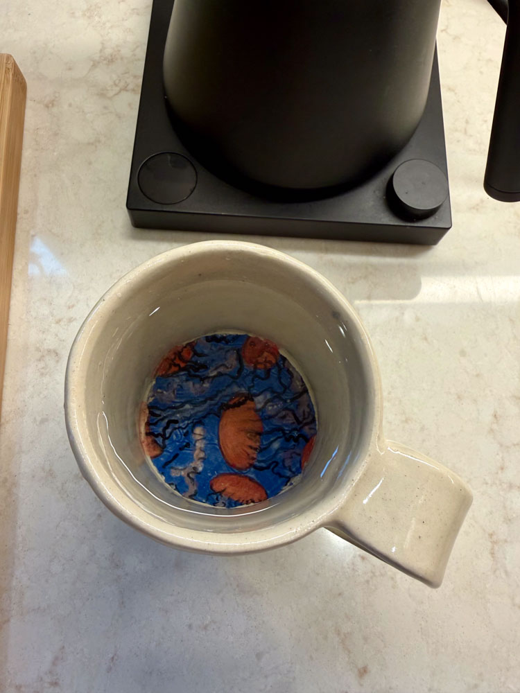
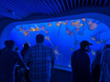
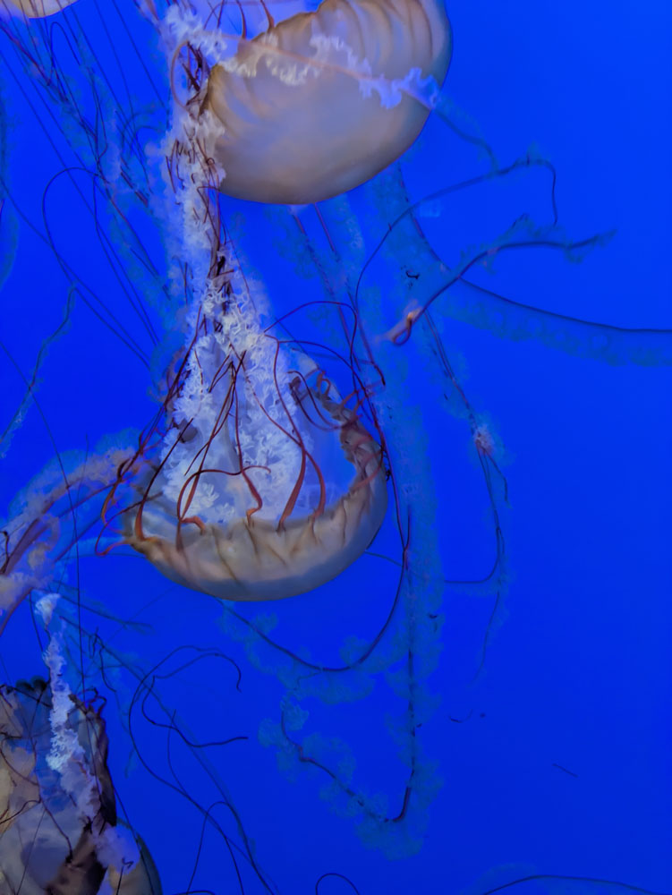
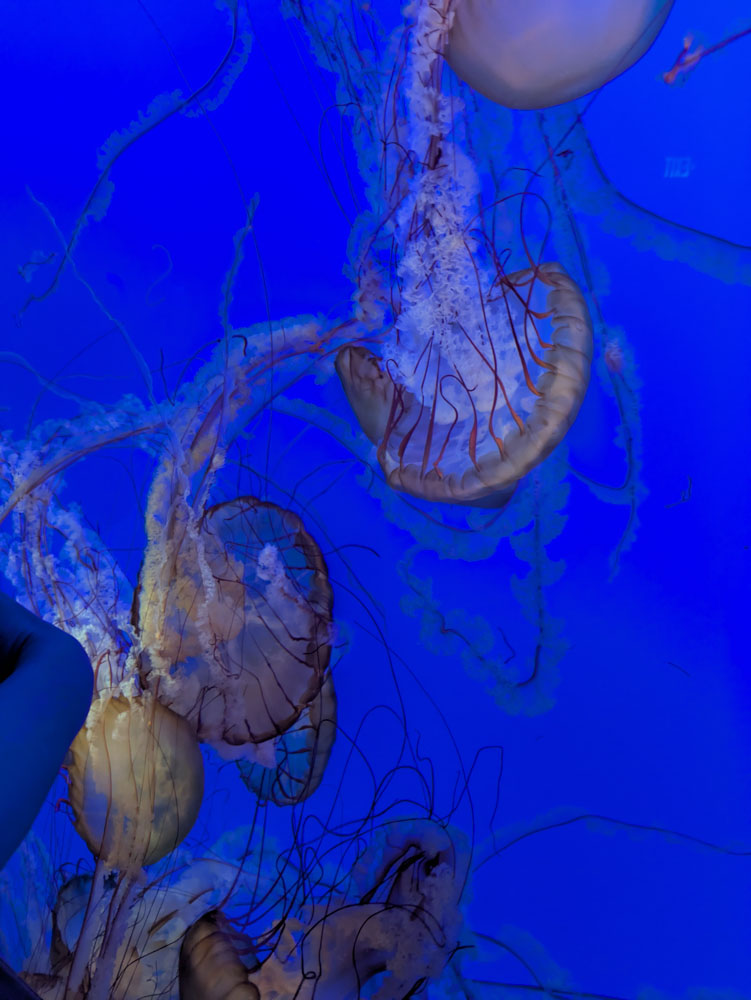
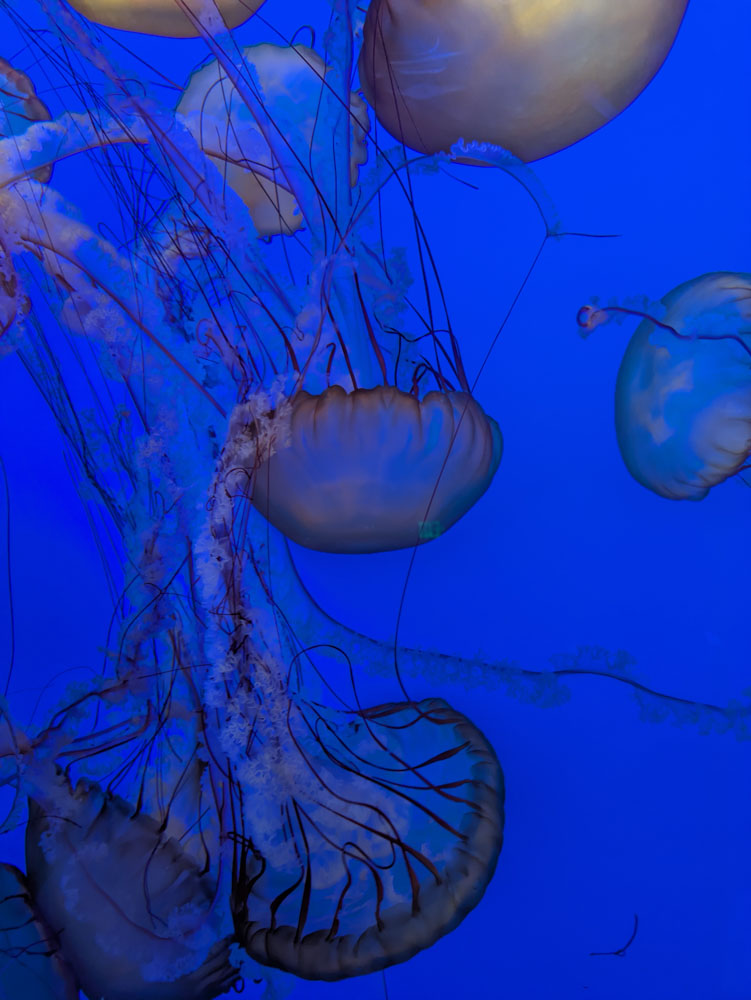
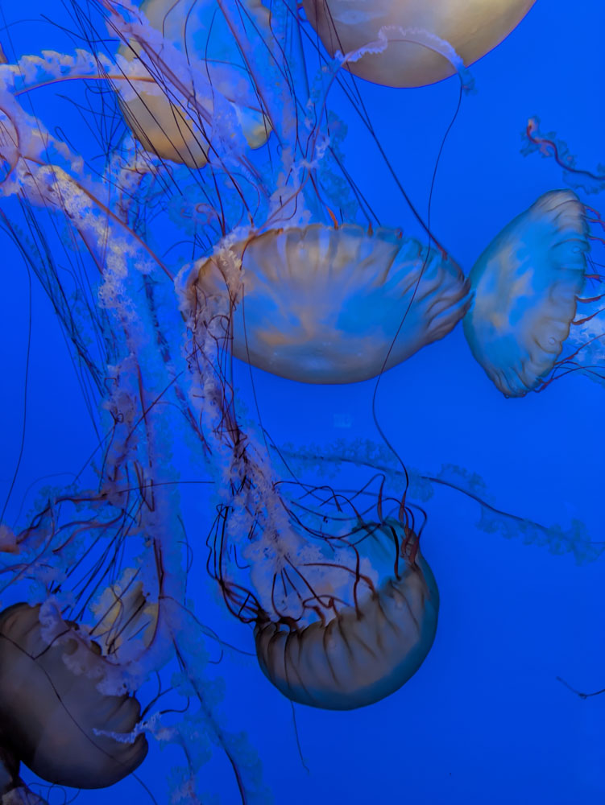
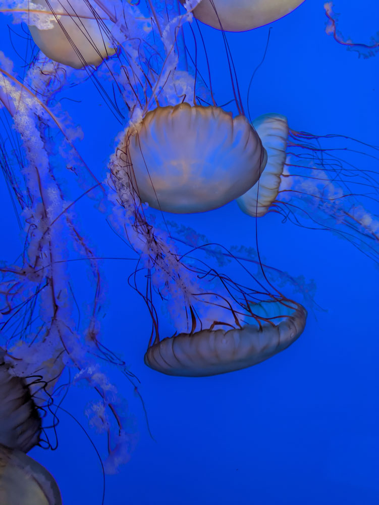
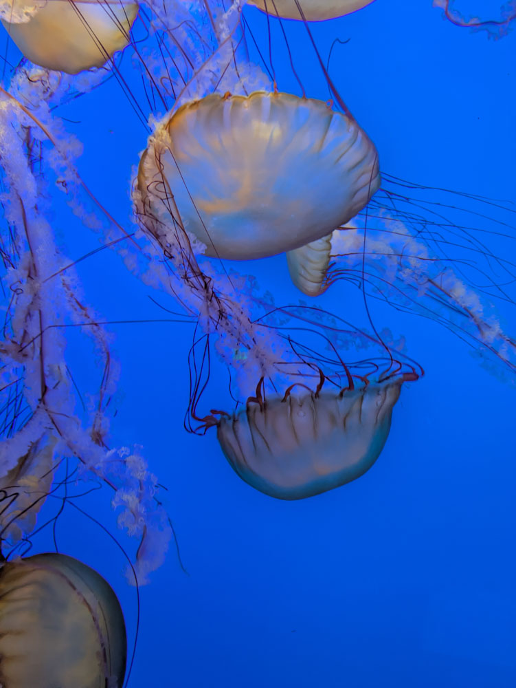

{group="glass-jelly-mug" fig-alt="inside view of glass jellyfish mug"}

From the Monterey Bay Acquarium, again this idea of a painting on the inside of a mug. For this one I wanted to see if I could make the rest of the mug as plain as possible. Plain clay (just clear glaze), dead simple design, just a plain ass plain ass mug, but with this painting inside. 

The glass jellyfish room at the Monterey Bay Aquarium was dark, with this glowing light on the jellyfish. I found them hypnotic. The flatness of underglaze painting isn't at all the right medium for the glowing 'lit from within' feeling, but I did it anyways. God, they're beautiful. The Monterey Bay Aquarium has a [live webcam](https://www.youtube.com/watch?v=eQ_foBERmzA).

{group="glass jelly mug" fig-alt="pic of the room with the glass jellyfish"}

I don't understand them at all. I know a decent bit about mammals. I can kinda parse the basics of how mammals work. 
But these? How can they be alive and transparent? How? 

Where are their organs? 

What is life if there are just creatures this beautiful? 

::: {layout-ncol=2}
{group="glass-jelly mug" fig-alt="screenshot from live cam, so beautiful I can't even"}

{group="glass-jelly mug" fig-alt="screenshot from live cam"}

{group="glass-jelly mug" fig-alt="screenshot from live cam"}

{group="glass-jelly mug" fig-alt="screenshot from live cam"}

{group="glass-jelly mug" fig-alt="screenshot from live cam"}

{group="glass-jelly mug" fig-alt="screenshot from live cam"}
:::
