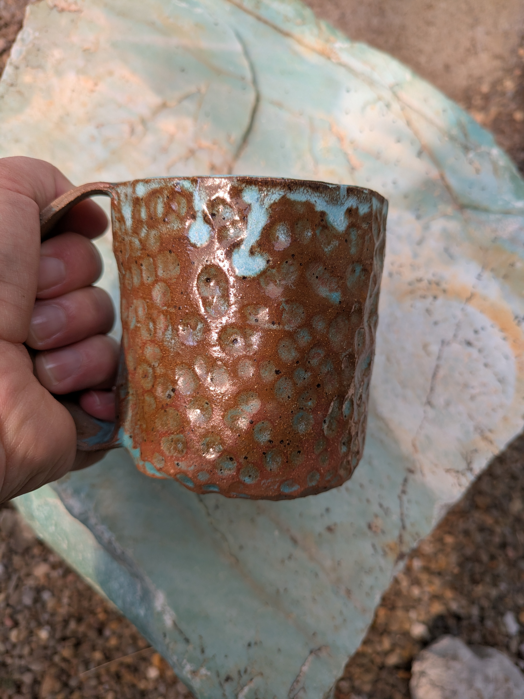
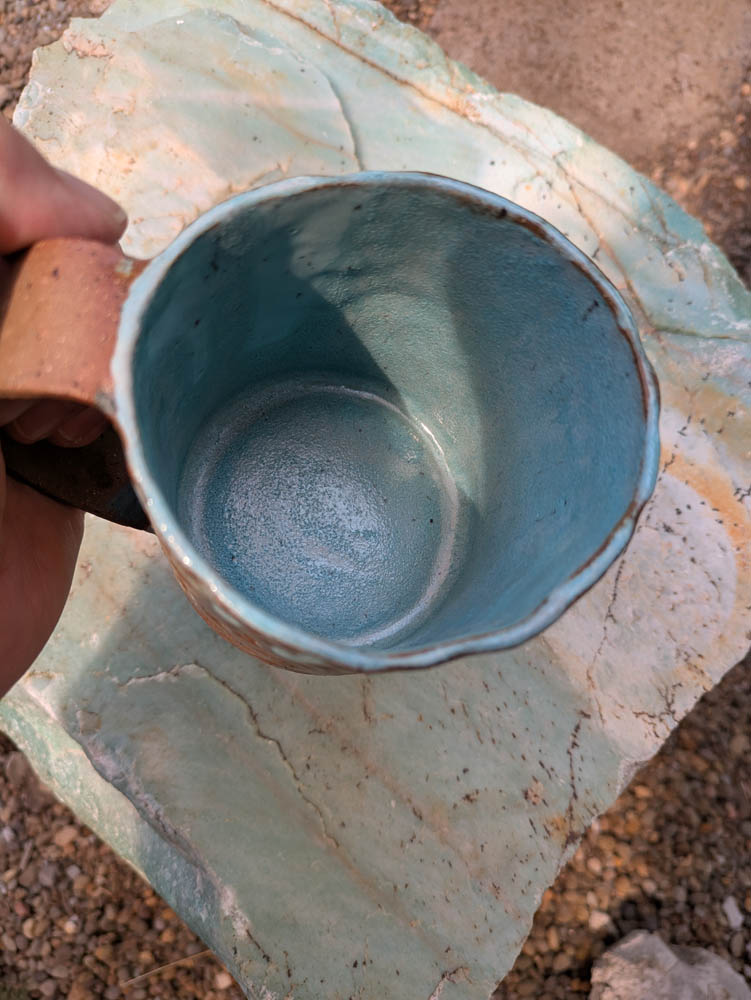
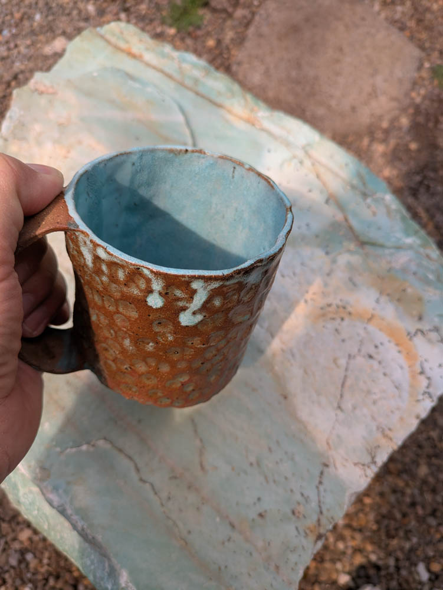

{group="hammered_mug_2" fig-alt="Hammered Mug the Second"}
{group="hammered_mug_2" fig-alt="Hammered Mug the Second, alternate view"}
{group="hammered_mug_2" fig-alt="Hammered Mug the Second, second alternate view"}
Honestly, the first hammered mug was way better. I was experimenting with thinner slabs to make the mugs lighter, but I've learned that means they warp more easily. 
