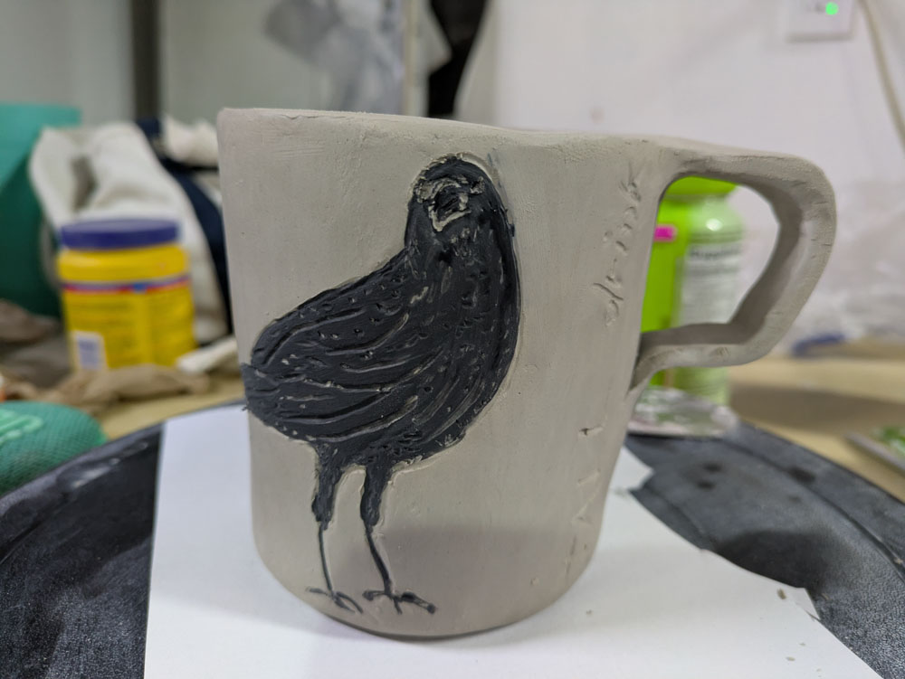
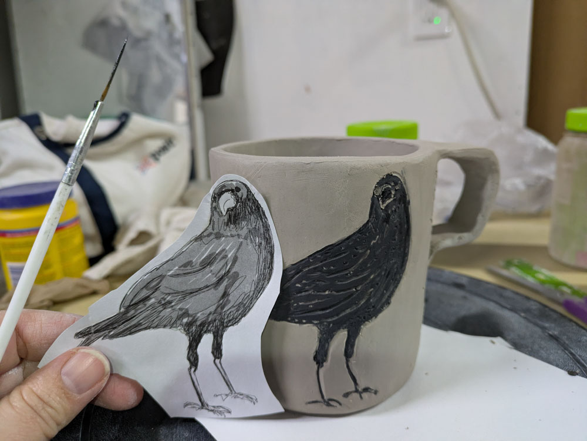
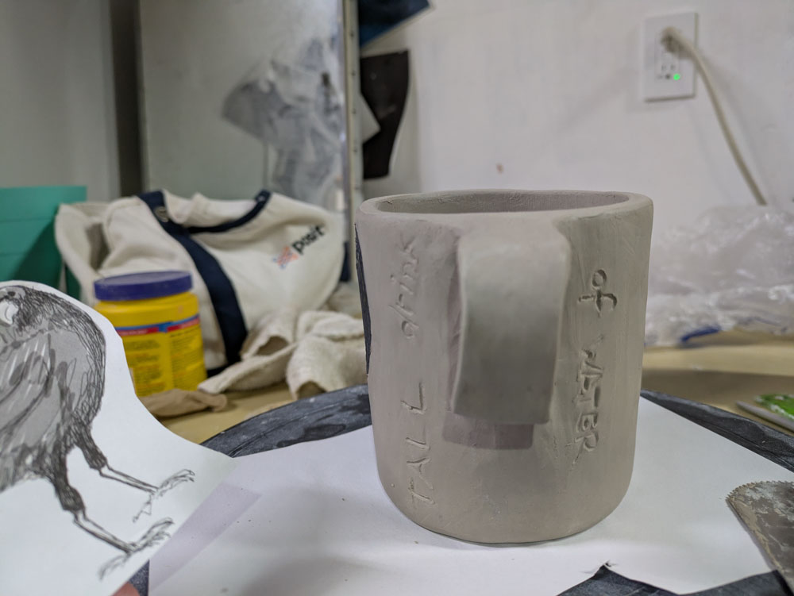
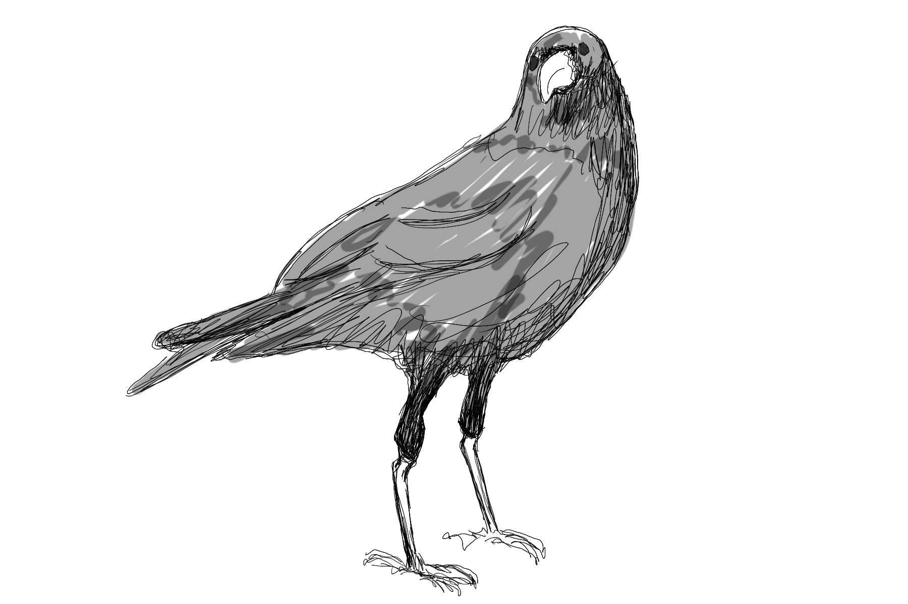
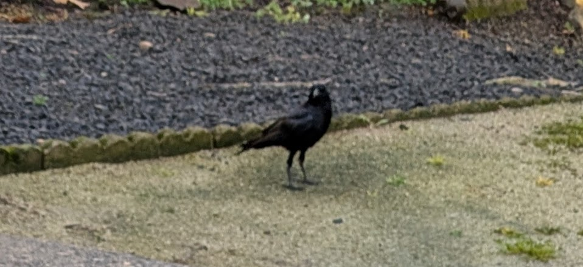

One of "my" crows is tall! I think. They're very hard to tell apart.

Why is this exciting? Because I'm starting to get to know them as individuals. 

{group="tall_crow" fig-alt="Tall Drink of Water Mug"}
{group="tall_crow" fig-alt="Tall Drink of Water Mug, alternate view"}
{group="tall_crow" fig-alt="Tall Drink of Water Mug, alternate view"}

I spend a lot of time thinking about the little leg feathers they have. Like little trousers, little jodpurs, little feather leggings they pull on in the morning.

{group="tall_crow" fig-alt="Tall Drink of Water Mug detail"}

Look at this crow. This is a tall crow. I swear to god. 

{group="tall_crow" fig-alt="Tall Drink of Water Mug, crow source image"}