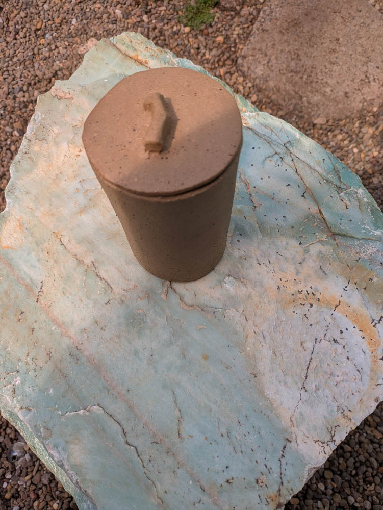
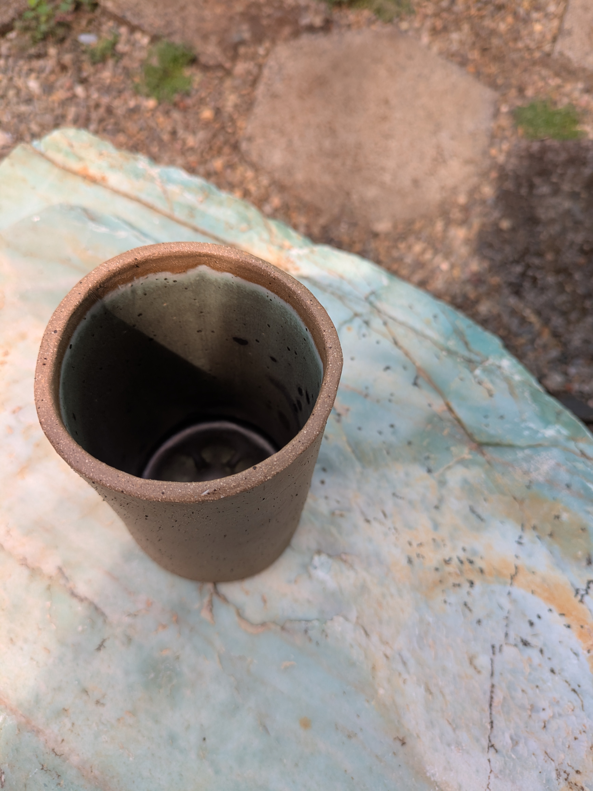
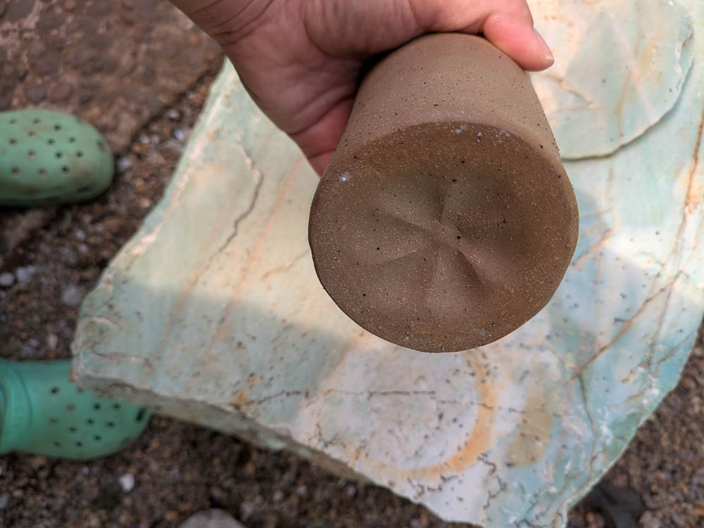

{group="tea_cannister" fig-alt="Tea Cannister"}
{group="tea_cannister" fig-alt="Tea Cannister, alternate view"}
{group="tea_cannister" fig-alt="Tea Cannister, second alternate view"}

The bottom is cool because I used a parmesan cheese jar as a form. :)
Also this holds Trader Joe's teabags just like a can of pringles. 