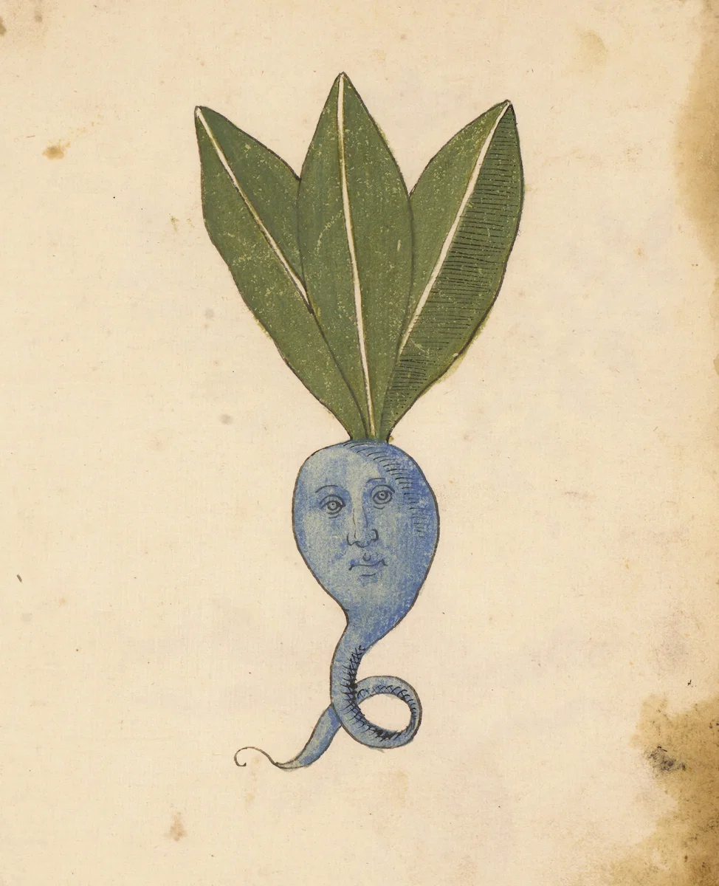

Somebody in Northern Italy made this around 1500. It feels like something weird a friend would make now. Why does that make me want to cry? I love it so much. 

{width="50%" fig-alt="print of a blue root with a face on it"}

[From The Public Domain Review](https://publicdomainreview.org/product/blue-root/)