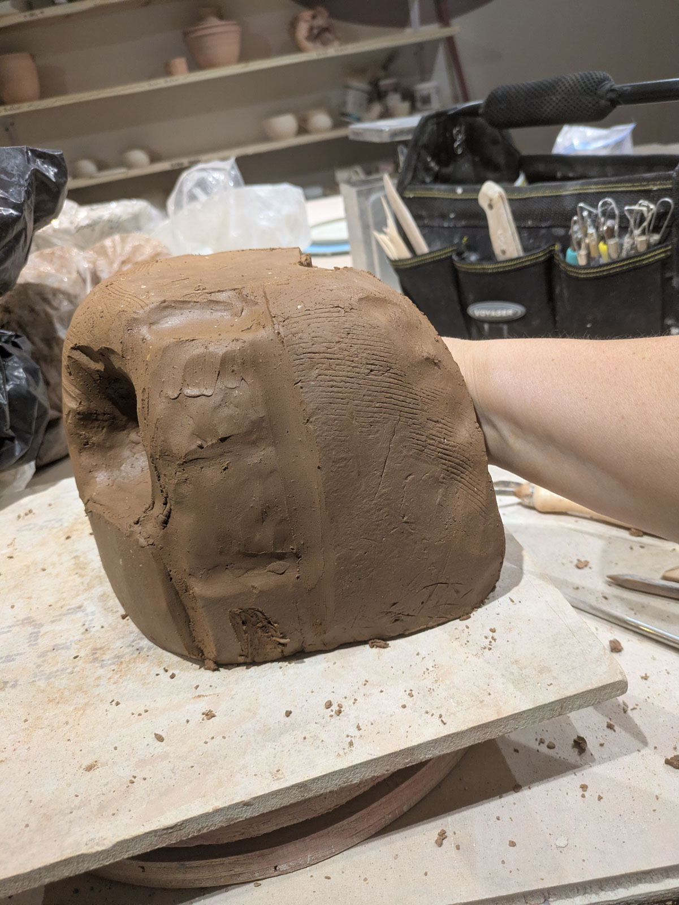

I was smoothing out the inside of a piece, my hand inside and not visible, just going by feel. 

I realized I had the same distinctive "I can't see, I'm going by feel" thinking face I saw on my dad and grandad's faces when I was a kid - when their hands were inside a cow feeling for calf feet. "Pulling a calf" it was called.

{width="50%" fig-alt="my hand inside a piece"}

