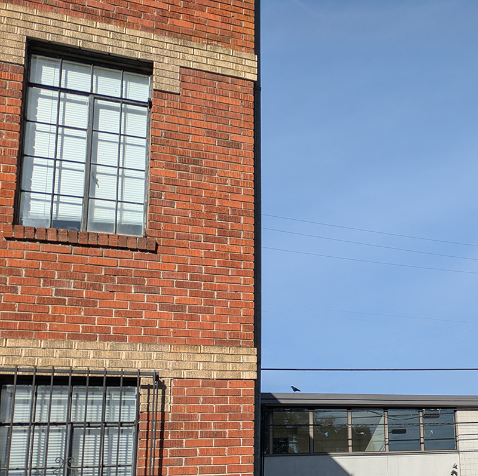

_Crows Walking_ is the name of my next album, my next book, whatever. It's all I really want to think about and draw. What is it I love so much about them walking around? I guess they just seem so like real individuals, just walking around, just a little stroll, even though they can fly??? If I could fly would I still want to walk around like that?

{width="70%" fig-alt="photo of a crow just walking along a roof"}
