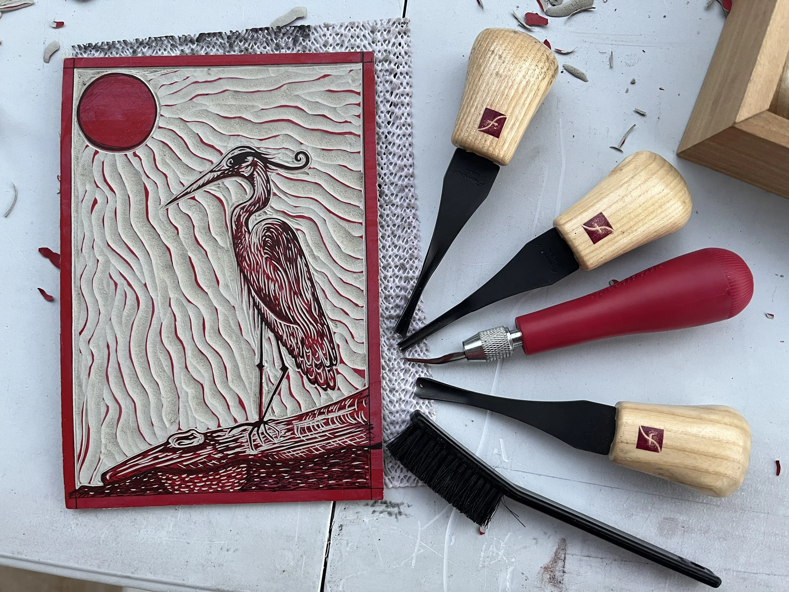

Y'all. I've looked to printmaking for inspiration with underglaze surface design a lot. The flatness of underglaze, the sort of blocky-ness. For example, linocuts often translate well into sgraffito. It's carving.

I mean, look at this gorgeous print on Whitaker Printmaker's site. This would transfer to sgraffito directly. 

{width="50%" fig-alt="Beautiful linocut print from Whitaker Printmakers"}

[Image credit](https://www.whitprint.com/registration/intro-linocut-mendez-d5w62-6dfs8)

But I recently just learned (Instagram) that you can screenprint onto ceramics. With a flat surface you could print directly onto the surface, but looks like printing onto a transfer-surface like newsprint is the most common way. 

Whuuuuutttt? 

This breaks my brain in a whole new good way. I love the mental process of constructing an image in printmaking. How you think in layers. Creating underglaze transfers is interesting b/c you think backwards. Whatever's on top will be applied to the surface first, being in back. 

This connects to something bigger for me. So I've long been a serial monogamist when it comes to media. I'll work in a medium for a while, but then find it limited and move on to something else. 

But ceramics - it's been almost two years now, and I keep sticking here. My interest and ideas of what are possible keep expanding. 

Sculpture, painting, printmaking, functional ideas...it keeps holding my interest.

A fellow ceramicist told me that's a thing they've heard before - that people come to ceramics and don't leave, because there's so much you can do with it. 
