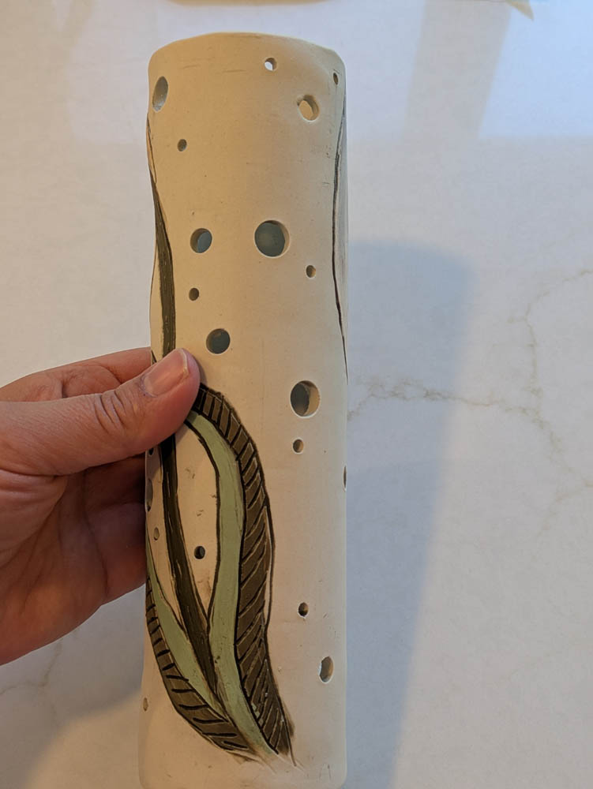
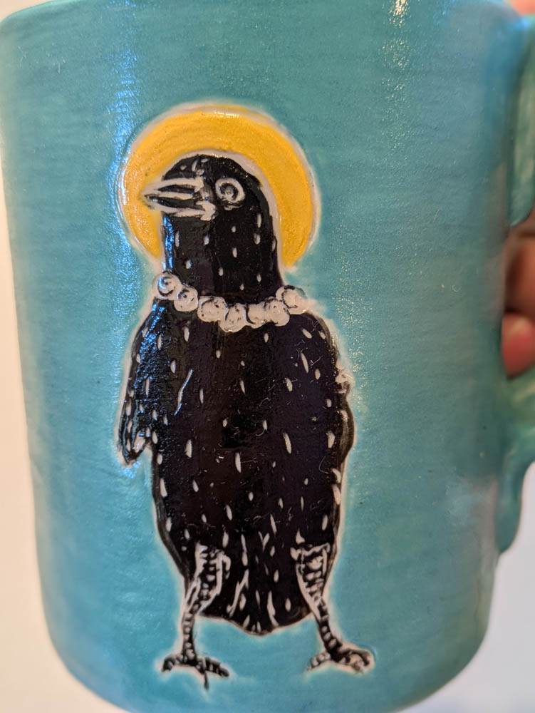
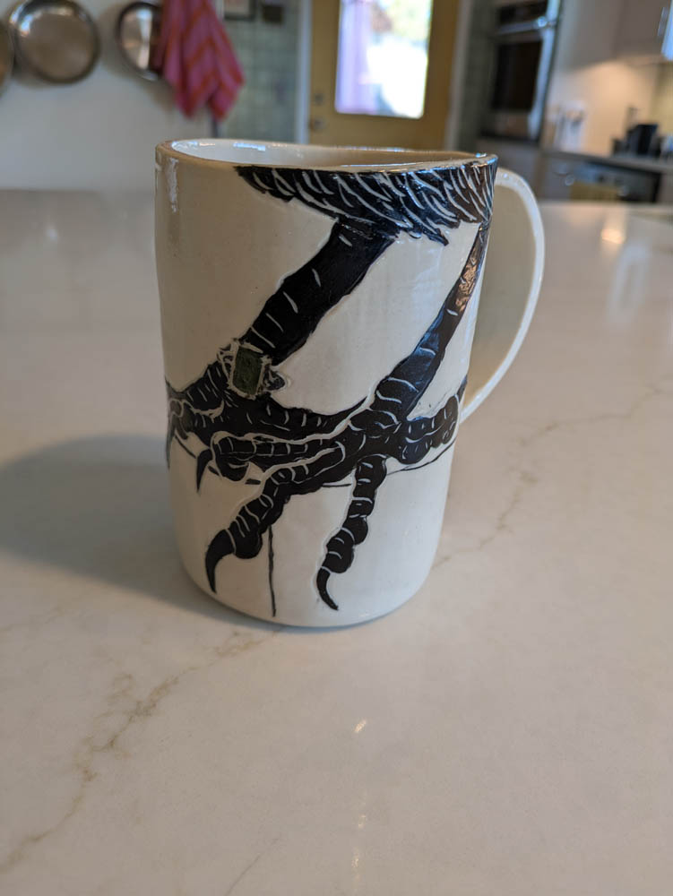
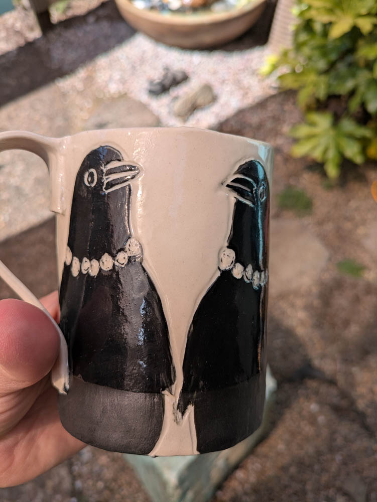
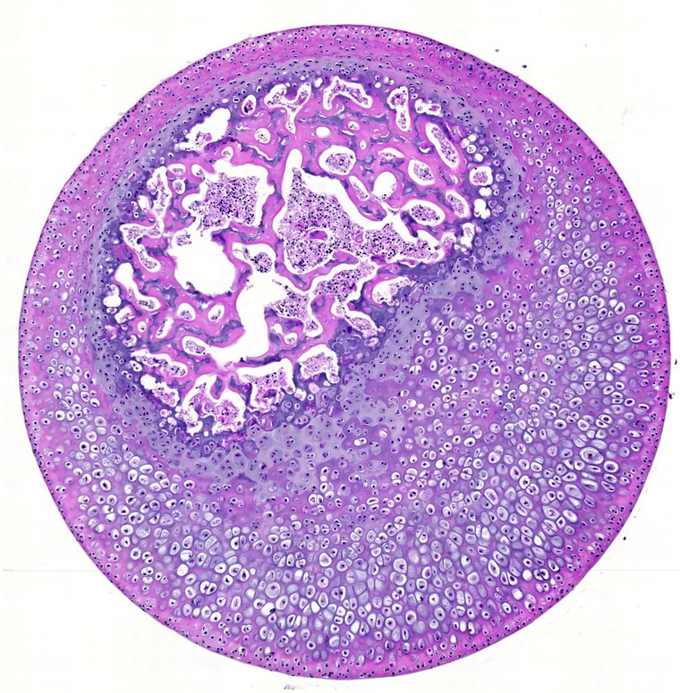
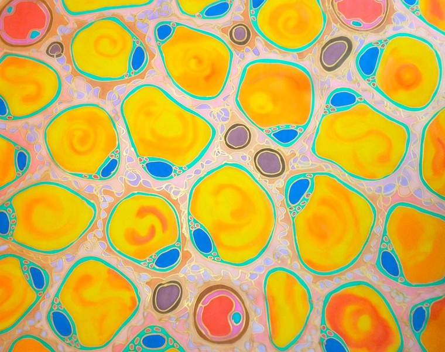

I’ve often been a serial monogamist when it comes to art. I’d dive deep into a medium but eventually feel “done.” I’d pack up my tools and move on.

But ceramics? It’s been two years, and I’m still here. Instead of hitting a wall, I keep finding more and more doors to walk through and explore.

### The Printmaking Connection

There’s a natural pull between printmaking and underglaze painting. The blocky, flat boldness of a linocut translates almost perfectly into sgraffito. Both are relief processes—you start with a solid field of color and "find" the image by excavating the surface. It’s a rhythmic, meditative way of drawing where you define the light by removing the dark.

Take this print from Whitaker Printmakers, for example. You start with a flat surface and carve away the negative space. This design would transfer to sgraffito perfectly.

{width="50%" fig-alt="Beautiful linocut print from Whitaker Printmakers"}  
[Image credit](https://www.whitprint.com/registration/intro-linocut-mendez-d5w62-6dfs8)

And here's some of my sgraffito work that would translate directly to a linocut. 

{width="30%" fig-alt="detail from incense burner"}  
{width="30%" fig-alt="The Crow Goddess"}  

{width="30%" fig-alt="Crow Feet Mug"}  

{width="30%" fig-alt="Crow Pearls Mug"}  

### Thinking in Layers (and Backwards)

I recently discovered that artists use silkscreen printing for underglaze! I knew about monoprinting—layering underglaze paintings on newsprint to transfer to clay—but the idea of screen printing introduces even more possibilities, including working with photographs. 

In printmaking, you have to think in layers. With ceramic transfers, you have to think backwards. Because you’re printing onto newsprint and then flipping it onto the clay, the first layer you lay down becomes the foreground. It’s a mental puzzle that forces you to see the finished piece before you’ve even touched the clay.

### A Bridge to the Past

This discovery pulled me back to art school, where I did a series of screenprints of histology slides—images of anatomy and physiology taken through a microscope. I wanted to capture that clinical, ethereal glow, and the feeling of discovering a tiny, hidden, beautiful world.

I printed them onto clear plastic (specifically, shower curtain liners that I spent an eternity ironing flat). The light moved through them just like it moved through the microscope lens.

Looking at slides of bone marrow and adipose tissue, you can see why an artist would be obsessed. The patterns are incredibly graphic.

::: {layout-ncol=2}
{width="30%" fig-alt="histology slide of bone marrow"}  
[Image credit] (https://wellcomecollection.org/works/n4ghqt9s).

{width="30%" fig-alt="histology slide of adipose tissue"}  
 [Image credit](https://wellcomecollection.org/works/ecjxx5uh). 

Unfortunately, I have no record of this series—it was my early 20s, and I was moving a lot. But the imagery has stayed with me.

### Why I’m Staying

A fellow ceramicist once told me that people come to clay and never leave because it’s the "infinite medium."

I’m starting to see why. It holds everything: sculpture, painting, industrial design, and now, printmaking. It doesn’t feel like I’m choosing one path anymore; it feels like all my past artistic "monogamies" are finally allowed to live in the same house.
