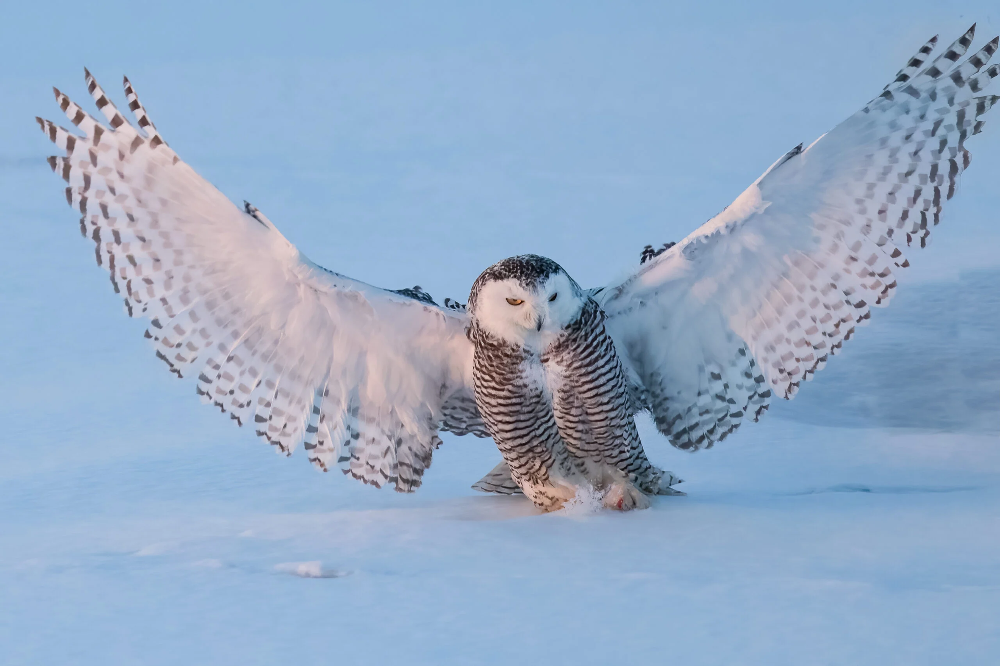
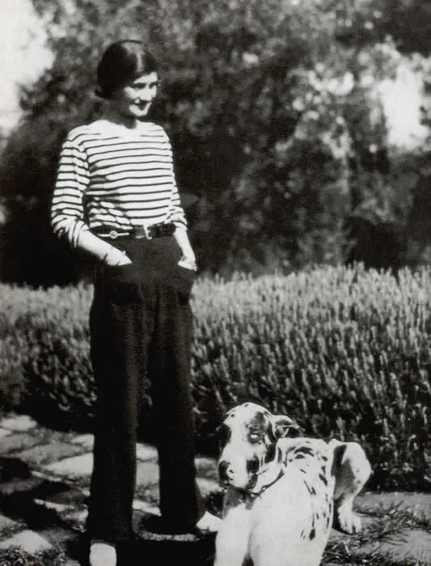
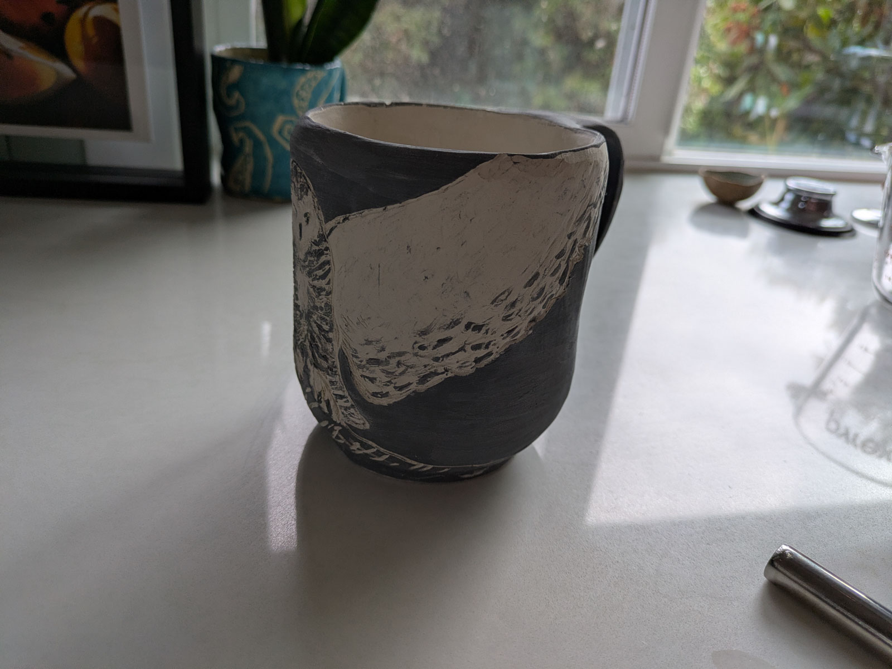
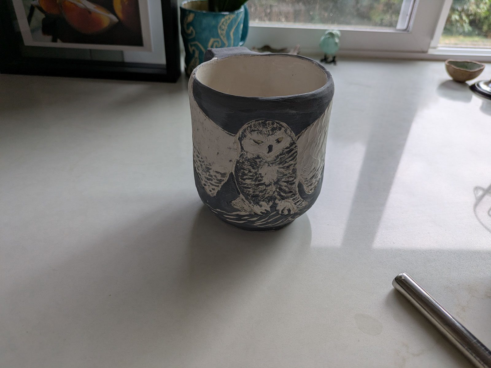
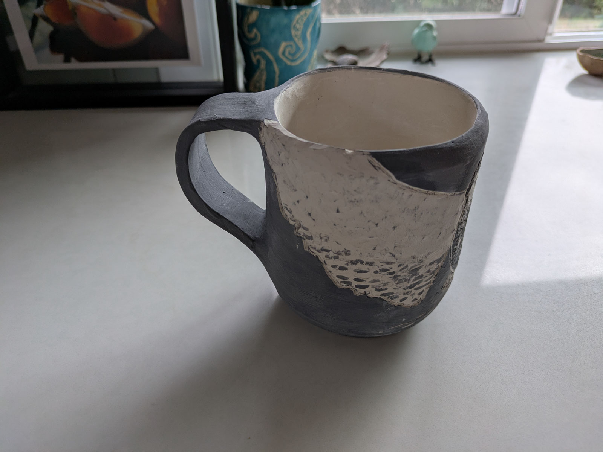

I've been looking at snowy owls recently. These stripes, y'all. So fierce and female*. Like Coco Chanel in 1928. I can't stop thinking about them.

{width="50%" fig-alt="Snow owl with wings spread, you can see these stripppppezzzzz"}

{width="50%" fig-alt="Coco Chanel in 1928"}

*Males are more snowy white. They don't have this gorgeous striped shirt. 

{width="50%" fig-alt="greenware snowy owl mug"} 

{width="50%" fig-alt="greenware snowy owl mug"} 

{width="50%" fig-alt="greenware snowy owl mug"} 

[Snowy owl](https://canadiangeographic.ca/articles/animal-facts-snowy-owl/)

[Read more about Coco Chanel and the history of the Breton stripe](https://www.cntraveler.com/story/the-history-of-the-breton-shirt-from-sailors-to-chanel)