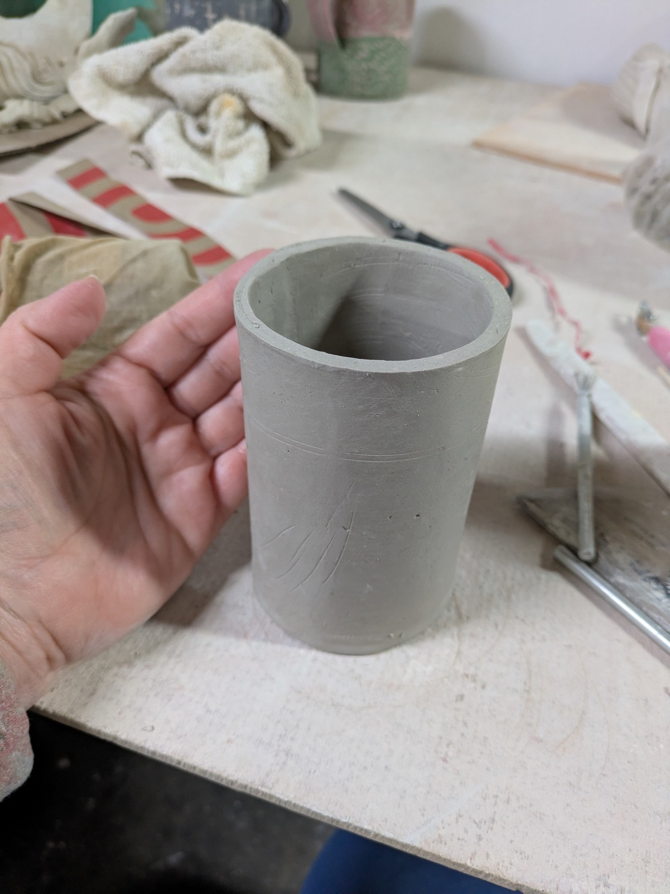
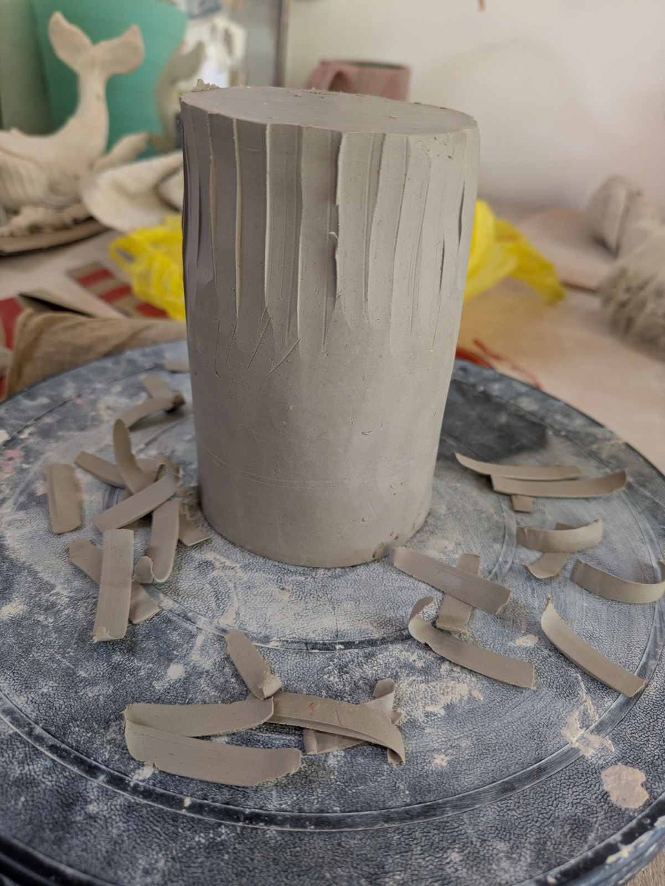
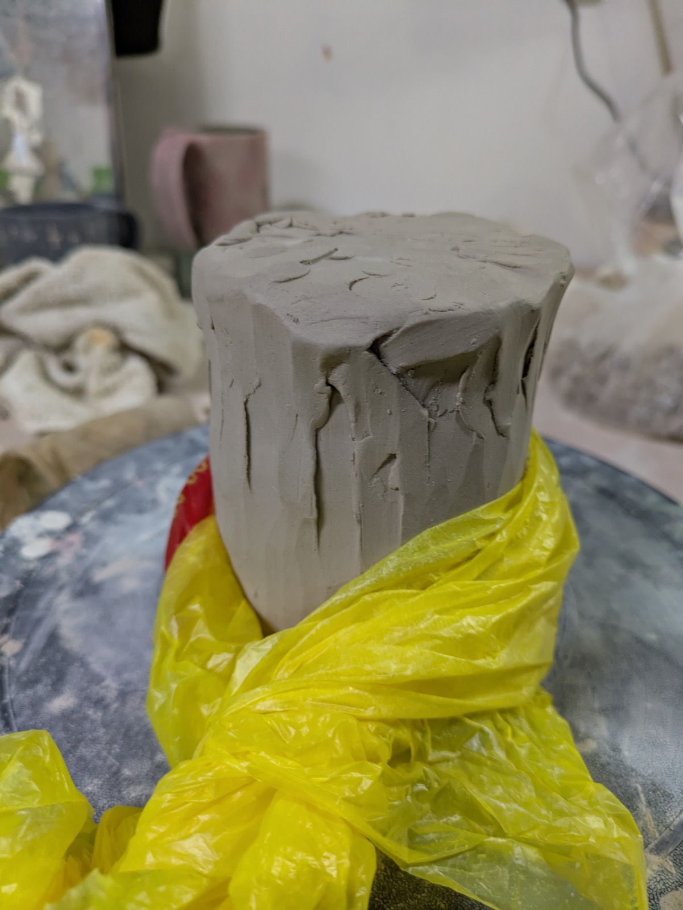
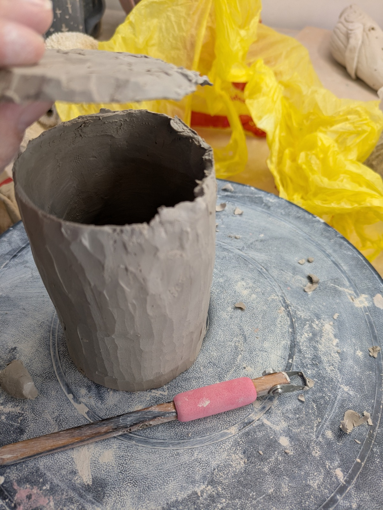
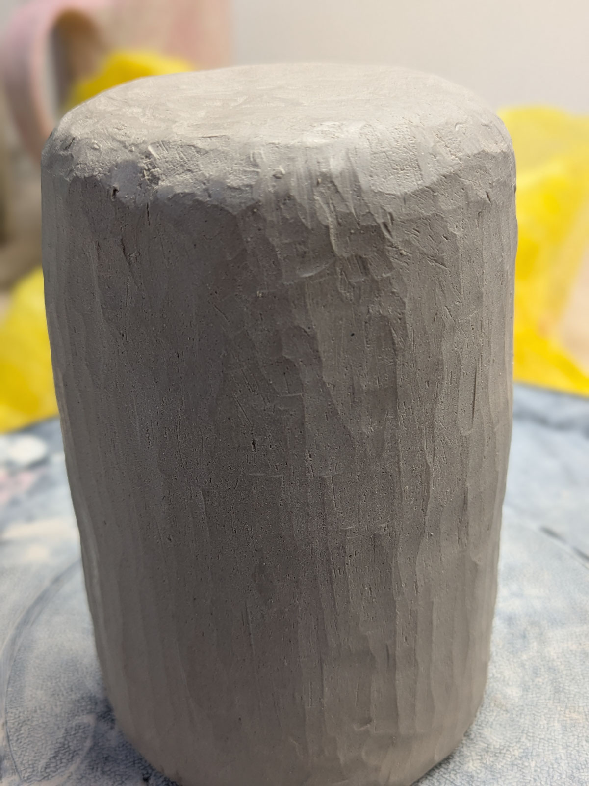

At a work dinner recently, I got into a conversation about the ideal mug.

I started this topic because I've really been obsessing over it — making the perfect mug. But I realized talking to my colleague that what I've been thinking of as the platonic ideal perfect mug is actually just *my* perfect mug. Big. Chunky. A handle you can really grab — so I can fill it with tea and wander my yard, check on my plants, talk to the crows. Something that says *go outside, this is sturdy, honestly if you drop it it'll be fine — go be wild.*

His perfect mug is very much not that. His isn't really a mug at all. Small. No handle. If it's too hot, he waits. A thin rim. Although there was something we shared — texture. It should feel good in your hands.

I loved this. Not the answer itself, but the *seriousness* of it. The way someone can have a whole philosophy about a small thing they hold every morning. These tiny details I've been turning over for months — he had his own version, and it was almost the opposite of mine.

So I made his mug. Or I tried to.

{width="50%" fig-alt="A small clay cylinder held in one hand — the starting point"}

I started with a basic cylinder. Simple. TINY. I didn't even have a form to use — I searched through my pantry for something the right size. Ten minutes of work if I'd left it alone.

{width="50%" fig-alt="The cylinder on the wheel with vertical carved lines, clay shavings scattered around"}

But I didn't leave it alone, because carving is the best part. It's the chaos demon — the thing I do because it feels good, not because it's in the plan. I carved vertical lines into it, and then I kept going.

{width="50%" fig-alt="The carved form wrapped in its yellow plastic blanket on the wheel"}

Carved holes. Was content patching them. Put a big coil on the outside, wrapped it up in its little blanket, then carved again. Carved more holes. The whole lid came off.

{width="50%" fig-alt="Hollowing out the form, hand reaching in with a pink tool nearby"}

So I put a coil on the inside and pressed it back together. Two hours on something that started as a ten-minute form.

There's always this tension for me: the planned thing versus the release of just *doing* something because it feels good. Making something beautiful versus making something interesting. Usually I lean toward chunky, substantial, heavy in the hand. But this piece ended up thin. Really thin. The rim is thin. The walls are thin. And that surprised me, because that's not how I usually work. But it makes sense. This isn't my mug. This was shaped by a different person's ideal — someone more refined, someone who waits for the coffee to cool.

{width="50%" fig-alt="Detail of texture"}  
  
The thing about the chaos demon-- it's not completely about destruction, ya know? It was headed somewhere. I like where this landed.

My experience is my instincts are usually headed somewhere interesting, even if it fails some of the time. 
 This is almost [kurinuki](https://ceramicartsnetwork.org/pottery-making-illustrated/pottery-making-illustrated-article/Kurinuki-Curious-251041) adjacent, except starting from a slab instead of a block. The subtractive carving away and one-of-a-kind result appeals to me. 

I also think about [Amy Sillman's](https://www.moma.org/artists/28808-amy-sillmanprocess) of making and remaking, when is it done? I'm continuously interested in the process, the feeling, the experience. I liked breaking it and putting it back together and breaking it again. It was interesting. 